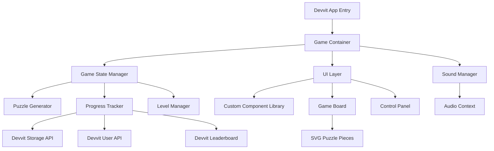

# Design Document

## Overview

The SVG Puzzle Game is a React-based application built on the Reddit Devvit platform. The game presents players with abstract geometric puzzles composed of rotatable SVG pieces. The architecture follows a component-based design with a custom UI library, procedural puzzle generation, sound management, and Reddit API integration for social features.

The game uses React for UI rendering, SVG for graphics, and the Devvit SDK for Reddit integration. All styling is handled through a custom component library with CSS modules, avoiding external UI frameworks.

## Architecture

### High-Level Architecture



### Component Hierarchy

```
DevvitApp
├── GameContainer
│   ├── Header
│   │   ├── UserProfile (avatar, username)
│   │   ├── LevelIndicator
│   │   └── SoundToggle
│   ├── GameBoard
│   │   ├── PuzzlePiece[] (SVG components)
│   │   └── CompletionAnimation
│   ├── ControlPanel
│   │   ├── Button (Start/Restart)
│   │   └── Button (View Leaderboard)
│   └── LeaderboardPanel (conditional)
│       └── LeaderboardEntry[]
```

## Components and Interfaces

### Core Game Components

#### GameContainer
The main orchestrator component that manages game state and coordinates all subsystems.

```typescript
interface GameState {
  currentLevel: number;
  pieces: PuzzlePiece[];
  isComplete: boolean;
  isSoundEnabled: boolean;
  startTime: number;
  completionTime: number | null;
}

interface GameContainerProps {
  context: Devvit.Context;
}
```

#### PuzzleGenerator
Generates procedurally unique abstract geometric patterns for each level.

```typescript
interface PuzzleConfig {
  level: number;
  pieceCount: number;
  rotationIncrement: number; // degrees
  seed: number;
}

interface GeneratedPuzzle {
  pieces: PuzzlePiece[];
  completeSvg: string;
  dimensions: { width: number; height: number };
}

class PuzzleGenerator {
  generate(config: PuzzleConfig): GeneratedPuzzle;
  private generateGeometricPattern(seed: number): SVGPattern;
  private splitIntoP ieces(pattern: SVGPattern, count: number): PuzzlePiece[];
}
```

The generator uses seeded randomization to create:
- Abstract geometric shapes (circles, polygons, curves, spirals)
- Vibrant color palettes from the green family
- Smooth cartoonish outlines with stroke styling
- Mathematically divisible patterns for clean piece separation

#### PuzzlePiece Component

```typescript
interface PuzzlePiece {
  id: string;
  svgPath: string;
  currentRotation: number;
  correctRotation: number;
  position: { x: number; y: number };
  color: string;
}

interface PuzzlePieceProps {
  piece: PuzzlePiece;
  rotationIncrement: number;
  onRotate: (pieceId: string) => void;
  isComplete: boolean;
}
```

The component renders an SVG element with:
- Click handler for rotation
- CSS transition for smooth rotation animation (300ms ease-out)
- Visual feedback on hover (slight scale and glow)
- Locked state when puzzle is complete

### Custom Component Library

#### Button Component

```typescript
interface ButtonProps {
  label: string;
  onClick: () => void;
  variant?: 'primary' | 'secondary';
  disabled?: boolean;
  icon?: React.ReactNode;
}
```

Styling features:
- Rounded corners (border-radius: 24px)
- Bouncy hover effect (scale transform with spring animation)
- Drop shadow (0 4px 12px rgba(0,0,0,0.15))
- Green gradient background (#4ade80 to #22c55e)
- Active state with pressed animation

#### SoundToggle Component

```typescript
interface SoundToggleProps {
  isEnabled: boolean;
  onToggle: (enabled: boolean) => void;
}
```

Styling features:
- Lever-style switch with cartoon flip animation
- Speaker icon that animates (waves when on, X when off)
- Smooth transition (400ms cubic-bezier)
- Green/gray color states

#### GameCard Component

```typescript
interface GameCardProps {
  children: React.ReactNode;
  glowColor?: string;
  padding?: string;
}
```

Styling features:
- Rounded corners (border-radius: 20px)
- Soft gradient background (linear-gradient with transparency)
- Glowing edge effect (box-shadow with color)
- Subtle inner shadow for depth

#### LeaderboardPanel Component

```typescript
interface LeaderboardEntry {
  rank: number;
  username: string;
  avatar: string;
  score: number;
  completionTime: number;
}

interface LeaderboardPanelProps {
  entries: LeaderboardEntry[];
  currentUser: string;
  onClose: () => void;
}
```

Styling features:
- Animated border (gradient border with rotation animation)
- Entry hover effects (background highlight)
- Avatar with circular frame
- Score badges with glow effect
- Current user highlight (different background color)

#### RotationIndicator Component

```typescript
interface RotationIndicatorProps {
  currentRotation: number;
  correctRotation: number;
  rotationIncrement: number;
}
```

Visual representation:
- Circular progress indicator around puzzle piece
- Color-coded (red → yellow → green as approaching correct rotation)
- Animated fill on rotation change

### Sound System

#### SoundManager

```typescript
interface SoundConfig {
  volume: number;
  enabled: boolean;
}

interface SoundAssets {
  rotate: string; // URL or base64
  success: string;
  mute: string;
  unmute: string;
  backgroundMusic: string;
}

class SoundManager {
  private audioContext: AudioContext;
  private sounds: Map<string, AudioBuffer>;
  private backgroundMusic: HTMLAudioElement;
  
  initialize(assets: SoundAssets): Promise<void>;
  playSound(soundName: string): void;
  toggleBackgroundMusic(enabled: boolean): void;
  setVolume(volume: number): void;
}
```

Sound implementation:
- Web Audio API for sound effects (low latency)
- HTML5 Audio for background music (looping)
- Preload all sounds on game initialization
- Fade in/out for background music transitions

### Reddit Devvit Integration

#### DevvitService

```typescript
interface UserProfile {
  username: string;
  avatar: string;
  karma: number;
}

interface ProgressData {
  userId: string;
  currentLevel: number;
  highestLevel: number;
  totalCompletions: number;
  bestTime: number;
  soundEnabled: boolean;
}

class DevvitService {
  constructor(private context: Devvit.Context);
  
  // User API
  async getUserProfile(): Promise<UserProfile>;
  
  // Storage API
  async saveProgress(data: ProgressData): Promise<void>;
  async loadProgress(): Promise<ProgressData | null>;
  
  // Leaderboard API
  async updateLeaderboard(score: number, time: number): Promise<void>;
  async getLeaderboard(limit: number): Promise<LeaderboardEntry[]>;
  
  // Posts API
  async shareAchievement(level: number, time: number): Promise<void>;
}
```

Storage schema:
- Key: `player_progress_{userId}`
- Value: JSON-serialized ProgressData
- Leaderboard key: `leaderboard_scores` (sorted set)

## Data Models

### Puzzle State Model

```typescript
interface PuzzleState {
  level: number;
  pieces: PuzzlePiece[];
  rotationIncrement: number;
  isComplete: boolean;
  startTime: number;
  moves: number;
}
```

### Level Configuration Model

```typescript
interface LevelConfig {
  level: number;
  pieceCount: number;
  rotationIncrement: number;
  complexity: 'simple' | 'medium' | 'complex';
}

const LEVEL_PROGRESSION: LevelConfig[] = [
  { level: 1, pieceCount: 3, rotationIncrement: 90, complexity: 'simple' },
  { level: 2, pieceCount: 4, rotationIncrement: 90, complexity: 'simple' },
  { level: 3, pieceCount: 5, rotationIncrement: 90, complexity: 'simple' },
  { level: 4, pieceCount: 6, rotationIncrement: 90, complexity: 'medium' },
  { level: 5, pieceCount: 7, rotationIncrement: 45, complexity: 'medium' },
  // ... continues with increasing difficulty
];
```

### SVG Pattern Model

```typescript
interface SVGPattern {
  viewBox: string;
  elements: SVGElement[];
  colorPalette: string[];
}

interface SVGElement {
  type: 'circle' | 'polygon' | 'path' | 'ellipse';
  attributes: Record<string, string | number>;
  style: CSSProperties;
}
```

## Error Handling

### Error Categories

1. **Devvit API Errors**
   - Network failures
   - Authentication issues
   - Rate limiting
   - Storage quota exceeded

2. **Game Logic Errors**
   - Invalid puzzle state
   - Corrupted save data
   - Puzzle generation failures

3. **Audio Errors**
   - Failed to load sound assets
   - Audio context initialization failure
   - Unsupported audio format

### Error Handling Strategy

```typescript
interface GameError {
  type: 'devvit' | 'game' | 'audio' | 'unknown';
  message: string;
  recoverable: boolean;
}

class ErrorHandler {
  handle(error: GameError): void {
    // Log error
    console.error(`[${error.type}] ${error.message}`);
    
    // Show user-friendly message
    if (!error.recoverable) {
      this.showFatalError(error);
    } else {
      this.showRecoverableError(error);
    }
    
    // Attempt recovery
    if (error.recoverable) {
      this.attemptRecovery(error);
    }
  }
  
  private attemptRecovery(error: GameError): void {
    switch (error.type) {
      case 'devvit':
        // Retry with exponential backoff
        break;
      case 'game':
        // Reset to last known good state
        break;
      case 'audio':
        // Disable audio and continue
        break;
    }
  }
}
```

Specific error handling:
- **Devvit API failures**: Retry up to 3 times with exponential backoff, fallback to local state
- **Storage failures**: Continue with in-memory state, show warning to user
- **Audio failures**: Disable sound system, allow gameplay to continue
- **Puzzle generation failures**: Regenerate with different seed, fallback to predefined patterns

## Testing Strategy

### Unit Testing

Test coverage for:
- **PuzzleGenerator**: Verify pattern generation, piece splitting, rotation calculations
- **SoundManager**: Mock Audio API, test play/pause/volume controls
- **DevvitService**: Mock Devvit APIs, test data serialization
- **Custom Components**: Test rendering, interactions, styling

```typescript
describe('PuzzleGenerator', () => {
  it('should generate unique patterns for different seeds', () => {
    const gen = new PuzzleGenerator();
    const puzzle1 = gen.generate({ level: 1, pieceCount: 4, rotationIncrement: 90, seed: 123 });
    const puzzle2 = gen.generate({ level: 1, pieceCount: 4, rotationIncrement: 90, seed: 456 });
    expect(puzzle1.completeSvg).not.toEqual(puzzle2.completeSvg);
  });
  
  it('should create correct number of pieces', () => {
    const gen = new PuzzleGenerator();
    const puzzle = gen.generate({ level: 1, pieceCount: 5, rotationIncrement: 90, seed: 123 });
    expect(puzzle.pieces).toHaveLength(5);
  });
});
```

### Integration Testing

Test scenarios:
- Complete puzzle flow from start to finish
- Level progression and difficulty scaling
- Leaderboard updates after puzzle completion
- Progress save and restore across sessions
- Sound toggle affecting all audio elements

### Visual Testing

- Component library visual regression tests
- Animation smoothness verification
- Responsive layout testing
- Color palette consistency

### Devvit Platform Testing

- Test in Devvit playground environment
- Verify Reddit API integration
- Test storage persistence
- Validate post creation for achievements

## Performance Considerations

### Optimization Strategies

1. **SVG Rendering**
   - Use CSS transforms for rotations (GPU-accelerated)
   - Minimize SVG path complexity
   - Cache generated patterns
   - Use `will-change` CSS property for animated elements

2. **State Management**
   - Memoize expensive computations (React.useMemo)
   - Optimize re-renders with React.memo
   - Debounce storage operations

3. **Audio**
   - Preload all sound assets
   - Use Web Audio API for low-latency effects
   - Limit concurrent sound playback

4. **Devvit API Calls**
   - Batch storage operations
   - Cache user profile data
   - Implement request debouncing for leaderboard updates

### Performance Targets

- Initial load: < 2 seconds
- Puzzle generation: < 500ms
- Rotation animation: 60 FPS
- Sound effect latency: < 50ms
- Leaderboard update: < 2 seconds

## Deployment and Configuration

### Devvit App Structure

```
svg-puzzle-game/
├── devvit.yaml           # Devvit app configuration
├── src/
│   ├── main.tsx          # Devvit app entry point
│   ├── components/
│   │   ├── ui/           # Custom component library
│   │   ├── game/         # Game-specific components
│   │   └── reddit/       # Reddit integration components
│   ├── services/
│   │   ├── PuzzleGenerator.ts
│   │   ├── SoundManager.ts
│   │   └── DevvitService.ts
│   ├── hooks/
│   │   ├── useGameState.ts
│   │   ├── useSound.ts
│   │   └── useDevvit.ts
│   ├── styles/
│   │   └── components/   # CSS modules
│   ├── assets/
│   │   └── sounds/       # Audio files (base64 encoded)
│   └── utils/
│       ├── errorHandler.ts
│       └── constants.ts
└── package.json
```

### Configuration

```yaml
# devvit.yaml
name: svg-puzzle-game
version: 1.0.0
description: An SVG-based abstract puzzle game
permissions:
  - identity
  - storage
  - posts
```

### Environment Variables

- `SOUND_VOLUME_DEFAULT`: 0.7
- `MAX_LEADERBOARD_ENTRIES`: 10
- `PUZZLE_SEED_BASE`: 42
- `ANIMATION_DURATION_MS`: 300

## Future Enhancements

Potential features for future iterations:
- Daily challenge mode with global leaderboard
- Multiplayer race mode
- Custom puzzle creator
- Achievement system with badges
- Difficulty presets (easy, medium, hard)
- Color blind mode
- Hint system for stuck players
- Puzzle replay/solution viewer
